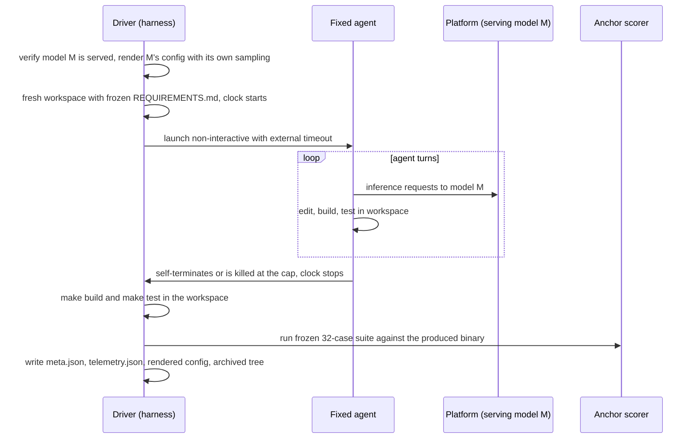

# compare-models

Comparing a **set of models** on a single, fixed coding agent and a single,
fixed inference platform — to see which model produces the most correct,
finished solution, and why.

Disclaimer: This works for me — that's the entire guarantee. Built with AI in
the loop, so check your own biases before you love it or hate it on principle.
Use at your own risk, fork freely, and don't @ me when it explodes. (But do drop
me a note if it helps — pay it forward.)

---

## Executive summary

- **What this is.** A controlled benchmark that inverts
  [compare-agents](https://github.com/gherlein/compare-agents) and
  [compare-platform](https://github.com/gherlein/compare-platform). Those pinned
  the model and varied the agent, or pinned the agent and varied the platform.
  Here the **model is the only variable**: one fixed coding agent, one fixed
  platform, one frozen task (implement a PNG decoder that passes a frozen 32-case
  suite), run across a chosen set of models. Full method in
  [VISION.md](VISION.md).

- **Correctness leads.** Because the model is what determines code quality, the
  **anchor pass rate (correctness) is the primary ranking metric** and
  clean-completion rate is co-primary. Wall-clock time, tokens, and turns are
  the explanatory layer — they explain a result, they never reorder the ranking.
  A faster model that writes wrong code ranks below a slower one that writes
  correct code.

- **Same everything except the model.** Every model is driven by the same agent,
  on the same platform, against the same frozen task, prompt, and scoring suite,
  under the same time cap and isolation. What is deliberately *not* normalized is
  each model's own vendor-recommended sampling and native context window — that
  bundle *is* the model under test (see [VISION.md](VISION.md)).

- **⚠️ Every verdict is conditional.** A model ranking here is *"this model, as
  driven by this agent, on this platform."* A different fixed agent or platform
  could reorder the models. This caveat is load-bearing, stated up front, and
  built into the report. See [The agent- and platform-fit caveat](#the-agent--and-platform-fit-caveat).

---

## The two fixed controls, and the one variable

| | Role | Selected by | Default |
|---|---|---|---|
| **Platform** | fixed control | `TARGET=` | `dgx` |
| **Agent** | fixed control | `AGENT=` | `omp` |
| **Model** | the variable | `config/<target>/models.json` | the whole set |

**Platforms** (`TARGET`): `dgx` — NVIDIA GB10 (ASUS Ascent GX10) running SGLang
at `http://dgx:8888`; `local` — this host's Lemonade server (llama.cpp,
OpenAI-compatible) at `http://localhost:13305`. Each is one file,
`config/targets/<target>.sh`, defining the platform constants
(`SERVER_URL`, `OPENAI_BASE_URL`, `PROVIDER_ID`, `CONFIG_DIR`),
`target_serve_model`, and three server-introspection functions
(`server_model_info`, `server_running_reqs`, `server_counters`) — so the rest of
the harness carries no platform-specific shapes.

**Agents** (`AGENT`): one of `omp`, `hax`, `kit`, `pi` — the four agents
compare-agents characterized. `omp` is the default because its dialect engine
can drive tool calling on models that don't natively support it, which widens
the set of models a single fixed agent can fairly compare. Each is one adapter,
`harness/agents/<agent>.sh`.

**Models** (the variable): the set to compare lives in
`config/<target>/models.json`. Each entry is the whole model bundle — `id` (the
short label used in trial ids and results), `served_model` (the id the server
reports and the agent selects), `model_path` (the checkpoint preflight
verifies), `context_length`, `max_tokens`, and the model's own `sampling`. Edit
this file to the models you actually serve.

---

## Quick start

```sh
make preflight                    # verify platform + chosen agent, record the model set
make anchor-selftest              # prove the frozen suite passes the reference pngdec
make trial MODEL=qwen3-27b-nvfp4 N=0   # one shakedown trial (N=0 is never scored)
make run-all TRIALS=1             # one trial per model in the set (the N=1 default)
make score                        # anchor-ranked report -> results/<target>/<agent>/scores.md
```

`TARGET` and `AGENT` select the two controls; both default so the commands above
run `omp` on `dgx`:

```sh
make run-all TRIALS=5 AGENT=hax TARGET=local
make score            AGENT=hax TARGET=local
```

`N` defaults to 1 (VISION.md: a fast triage default). **A single trial is
indicative, not a ranking** — agentic runs are stochastic at nonzero
temperature. Raise `TRIALS` for trustworthy medians and rates; `score.md` prints
a note whenever any model has N≤1.

Batches are resumable: a trial with a valid `meta.json` is skipped on re-run.

### One model at a time on sglang

SGLang serves **one model per server instance** — there is no online swap. To
run a multi-model set on `dgx`, run one model's batch, relaunch sglang with the
next model, and run the next batch:

```sh
# with sglang serving model A:
make run-all TRIALS=5 MODEL=qwen3-27b-nvfp4
# relaunch sglang with model B, then:
make run-all TRIALS=5 MODEL=example-14b
make score        # scores every model's trials found on disk
```

`serve_model` (in `harness/lib.sh`) dies with this instruction if the model you
ask for is not the one currently live. On `local` (Lemonade), which holds
several installed models and loads on demand, a plain `make run-all` iterates the
whole set — `target_serve_model` loads each model before its batch.

---

## How a trial works



The clock covers only the agent's run. Build, test, and scoring happen after it
stops, so driver-side cost never pollutes the timing.

### Per-model config rendering

compare-agents could ship a static config per agent because the model was
constant. Here the served model id, its sampling, and its context window change
per model, so each agent's config is **rendered per model** by
`harness/render_config.py` from the platform base URL plus the model entry, and
archived under the trial's `config/` directory. What stays frozen and SHA-256'd
into every trial is the renderer itself and `models.json` (which pins each
model's sampling), so the exact configuration a trial ran under is always
recoverable.

---

## What is held constant

| Control | Mechanism |
|---|---|
| Agent | one chosen agent, pinned version, recorded per trial; isolated per-trial profile/roots |
| Platform | one chosen platform; `preflight.sh` verifies it live |
| Context policy | the agent's own context-management strategy, identical across models |
| Task, prompt, scoring suite | frozen in `spec/`; SHA-256 recorded per trial |
| Time cap | identical external `timeout` for every model (`MAX_TIME`, default 90m) |
| Routing | every trial verified to hit the platform serving the model under test; mismatches voided |

**Deliberately *not* normalized:** each model's weights, quantization,
vendor-recommended sampling, and native context window — the bundle under test.

---

## Metrics

`make score` writes `results/<target>/<agent>/scores.{json,md}`, a per-model
report ordered by correctness:

- **anchor_rate** (primary): frozen-suite pass fraction; correctness of what the
  model produced, finished or not.
- **completed_unassisted_rate** (co-primary): fraction of trials that
  self-terminate cleanly within the cap.
- **finished_rate**: completed unassisted AND anchor rate ≥ threshold (default
  0.80).
- **time_to_finished, turns, tool_calls, turns_before_first_edit, tokens,
  compactions**: the explanatory route decomposition (never reorders the
  ranking).
- **cross-matrix, catch rate, suite over-strict**: task-integrity checks —
  whether a binary survives a suite it was not written against, and whether a run
  gamed the task with trivial tests.

`make compare ARGS="dgx/omp dgx/hax"` places two evaluations side by side per
model, so a ranking that reorders under a different fixed agent or platform is
immediately visible.

---

## Contamination / routing defense

Two layers, carried over from compare-agents:

1. `make config-smoke` runs a one-tool prompt through the chosen agent's real
   adapter path for each model and asserts the session records stamp exactly the
   pinned provider and the model's served id. `run-all` does this before each
   model's batch.
2. `harness/telemetry.py` checks the provider and model stamped on every model
   turn of every trial and voids the trial on any mismatch. Voided trials appear
   in the Excluded table, never reattributed. (kit's headless log carries no
   per-turn stamp, so its routing is proven server-side from the request-counter
   delta — see the comments in `telemetry.py`.)

---

## The agent- and platform-fit caveat

Every number here is *"this model, as driven by this agent, on this platform."*
A model that emits malformed tool calls under the chosen agent's format will
stall no matter how good its raw prose is; a different agent could rank the
models differently. This is an *agent-fit* effect, and `tool-call fidelity` in
the metrics is there to separate it from raw model quality. The report states
the conditionality up front and never launders a single-agent, single-platform
result into a model-intrinsic verdict. To probe it, run the same model set under
a second fixed agent and use `make compare`.

---

## Adding a model, changing the agent, changing the platform

- **Add a model:** append an entry to `config/<target>/models.json` (its
  `served_model`, `model_path`, `context_length`, and vendor-recommended
  `sampling`). No change to the task, scorer, agent adapter, or metrics.
- **Change the fixed agent:** set `AGENT=<hax|kit|pi|omp>`. Results are
  namespaced by agent, so evaluations never clobber each other.
- **Add a platform:** add one `config/targets/<name>.sh` implementing the
  platform interface, plus a `config/<name>/models.json`.

---

## Repository map

| Path | What |
|---|---|
| [README.md](README.md) | this guide |
| [VISION.md](VISION.md) | problem statement, methodology, and the conditionality caveat |
| `spec/` | frozen task (`REQUIREMENTS.md`, `PROMPT.txt`), the 32-case anchor suite, and the reference implementation validating it |
| `config/targets/<t>.sh` | platform definition (server constants + introspection + `target_serve_model`) |
| `config/<t>/models.json` | the model set compared on platform `<t>` — **the independent variable** |
| `harness/lib.sh` | fixed controls, model-set helpers, `serve_model` |
| `harness/render_config.py` | renders each agent's config for one model (per-model sampling) |
| `harness/agents/<a>.sh` | one adapter per agent (contract in `agents/omp.sh`) |
| `harness/preflight.sh` | verify platform + chosen agent live |
| `harness/config-smoke.sh` | prove routing per model before burning trial time |
| `harness/trial.sh` | one trial: serve, render, run, build, score, archive |
| `harness/run-all.sh` | per-model batch runner |
| `harness/telemetry.py` | session-log extraction and contamination voiding |
| `harness/score.py` | anchor-ranked report + cross-matrix + time decomposition |
| `harness/compare.py` | model ranking across evaluations, side by side |
| `results/<t>/<a>/` | trial artifacts (gitignored, regenerated) |

Agent workspaces live outside the repo at
`~/.cache/compare-models/worktrees/<target>/<agent>` (override with
`WORKTREES_ROOT`): the agent builds and tests inside its workspace during the
timed window, where NFS latency would pollute the explanatory timing. Each
trial's workspace is archived into `results/<t>/<a>/trials/<id>/tree/` after the
clock stops.

## Known caveats

- **The verdict is agent- and platform-relative** (see above) — the single most
  important limitation.
- **sglang serves one model per instance:** multi-model sets on `dgx` are run one
  batch at a time with a server relaunch between them.
- **kit cannot set `repetition_penalty`:** a model whose recommendation includes
  it runs under kit at kit's default (none). The renderer records this in the
  generated `kit-bench.yml`. The other three sampling knobs are matched.
- **N=1 is a triage default,** not a ranking. Raise `TRIALS` before citing any
  ordering.

---

*Built with AI in the loop. "Works for me" is the whole guarantee — check your
own biases, fork freely, and don't cite a single-trial ranking.*
