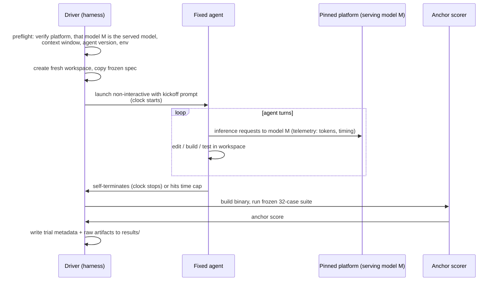

# Vision: Comparing Models on a Fixed Agent and Platform

## Core Question

Which model gets a fixed coding agent to a finished, correct solution best, when
everything except the model is held constant? This project is the fourth in a
lineage:

- [compare-gx10-to-G1a-coding](https://github.com/gherlein/compare-gx10-to-G1a-coding)
  held the agent constant and varied the inference server.
- [compare-agents](https://github.com/gherlein/compare-agents) pinned a single
  server and model and varied only the agent driving it.
- [compare-platform](https://github.com/gherlein/compare-platform) pinned a
  single agent, model family, and task, and varied only the platform underneath.
- **compare-models** (this project) pins a single agent, a single platform, and a
  single task, and varies only the model served behind the endpoint.

"Finished solution" has the same precise meaning it has had throughout the
lineage: the agent self-terminates, the produced binary builds, and it passes a
frozen, mechanically-scored test suite the model never sees. But the primary
metric is not the same, and the reason is the lineage's own logic. In
compare-agents the model was a control, so raw token quality was identical by
construction and wall-clock time was cleanly primary. In compare-platform two
different 4-bit quantizations could produce different code, so correctness rose
to be reported alongside time. Here the model *is* the variable, so correctness
is the whole point. **The frozen-suite pass fraction (anchor score) is the
primary metric, and clean-completion rate is co-primary.** Wall-clock time,
throughput, tokens, and turn count are the explanatory layer -- they explain the
result and never outrank it. A faster model that writes wrong code is worse than
a slower one that writes correct code, and the report is ordered that way.

This repository is a harness. It does not contain the agent, the models, the
platform, or human judgment about code quality. It contains the frozen task, the
frozen scoring suite, one pinned agent adapter, per-model serving definitions,
and the automation that runs each model's trials and records results.

## Models Under Test

One chosen agent drives every trial. One chosen platform hosts every model.
Against that fixed backdrop a chosen **set of models** is run through the
identical task, and each model's results are compared to the others'. "A model"
here means the whole served bundle -- the weights, the quantization, the model's
own vendor-recommended sampling, and its native context window -- not just the
checkpoint name.

An illustrative set on the **dgx** platform (SGLang on GB10); the actual set is
chosen per evaluation and every model in it must be servable on the pinned
platform:

| | Model A | Model B | Model C |
|---|---|---|---|
| Checkpoint | e.g. `Qwen3.8-27B-NVFP4` | e.g. a 14B-class model | e.g. a 30B-class model |
| Quantization | its own (as served) | its own | its own |
| Sampling | its own vendor-recommended | its own | its own |
| Context window | its own native limit | its own | its own |
| Served | one model at a time, swapped between batches | | |

A model is compared as its out-of-the-box, best-native self at a pinned serving
configuration. We do not force every model onto one identical sampling config or
pretend they share a context window -- those differences *are* part of what is
being measured. What we normalize is everything around the model: the agent, the
platform, the task, the prompt, the scoring, and the autonomy of the run.

## The Central Caveat: The Verdict Is Agent- and Platform-Relative

This is stated first, loudly, because it is the honest limit of the whole
project. **Every number this project produces is "this model, as driven by *this*
agent, on *this* platform."** The model does not run in a vacuum; it runs through
one specific agent's system prompt, tool schemas, tool-call format, and turn-loop,
on one specific serving stack. A model that emits malformed tool calls under the
chosen agent's format will stall no matter how good its raw prose is, and a
different agent could reorder the models entirely.

The consequence, carried over in spirit from compare-platform's quantization
caveat:

> A comparison across these models measures each model **as this agent drives it
> on this platform**, not the model in the abstract. It is not a
> serving-agnostic, agent-agnostic ranking of the models themselves.

This means:

- The ranking is conditional. Re-running the same model set under a different
  fixed agent, or on a different platform, is a *different* evaluation and may
  reorder the models. The report says so up front and never launders a
  single-agent, single-platform result into a model-intrinsic verdict.
- Sampling is **not** held identical across models. Each model runs at its own
  vendor-recommended sampling, treated as part of the model bundle -- exactly as
  compare-platform refused to force one box to run the other's quantization, and
  compare-agents refused to normalize each agent's own prompt and tools. Forcing
  one sampling config on every model would penalize models tuned for different
  defaults and answer a less useful question. Each model's sampling is recorded
  per trial.

We keep the comparison anyway, because the practical question an operator
actually asks is exactly this conditional one: *"If I put this agent and this
task on this platform, which of these models should I serve?"* The caveat is the
answer's fine print, not a reason to avoid the question.

## Systems Held Fixed: The Agent and the Platform

The independent variable is the model, so both the agent and the platform are
**controls**, chosen and pinned before the evaluation and recorded per trial.

**The fixed agent.** One of the four agents the lineage has characterized --
[hax](https://github.com/gherlein/hax),
[Pi](https://github.com/earendil-works/pi),
[oh-my-pi (omp)](https://github.com/can1357/oh-my-pi), or
[kit](https://github.com/mark3labs/kit) -- pinned at a recorded version and run
non-interactively under an isolated per-trial profile, exactly as in the prior
projects. It is the lens through which every model is observed, and it is the
same lens for all of them. A lean agent (hax) adds the least agent-side noise and
makes more of the observed difference attributable to the model; a heavier agent
(omp, Pi, kit) tests the models under a richer tool loop. Which agent is chosen
is a methodological decision recorded in every trial; changing it is a separate
evaluation, not a mixed one.

**The fixed platform.** One serving platform, selected per evaluation and pinned
for its whole duration:

- **dgx** -- NVIDIA GB10 (ASUS Ascent GX10) running SGLang, the lineage's primary
  stack.
- **local** -- this host's Lemonade server (llama.cpp, OpenAI-compatible) on a
  Strix Halo-class box.

Every model in the set must be servable on the pinned platform, and each is
served one at a time; the harness swaps the served model between batches and
re-verifies the live endpoint before each. The adapter and target interfaces are
identical to compare-agents' and compare-platform's, so a different agent or a
different platform can be slotted in later -- each such run a separate experiment
with its own controls.

## Why the Outcome Is Uncertain

Unlike compare-agents -- where both agents called an identical model, so raw
token quality was identical by construction -- here the models differ by
construction, so *some* difference is expected. The uncertainty is in its shape:

- A larger or higher-precision model may pass more anchor cases but take more
  wall-clock time per turn, trading speed for correctness.
- A smaller or more aggressively quantized model may be faster per turn yet fail
  to self-terminate cleanly, or terminate on code that misses edge cases the
  frozen suite catches.
- A model may drive the *chosen agent's* tool loop well or badly independent of
  its raw quality: a model that emits malformed tool calls under this agent's
  format stalls regardless of how good its prose is. This is an agent-fit effect,
  not a pure model-quality effect, and the metrics separate the two.
- Any model may fail to self-terminate on some trials. As in every prior project
  in this lineage, completion rate is a first-class result, not a footnote.

If two models reach similar anchor scores by very different routes -- one in few
correct turns, another after many stalls and retries -- or reach the same anchor
score at very different wall-clock times, that itself is the finding.

## What Is Held Constant

Everything except the model, verified by `make preflight` before every batch and
recorded in every trial's metadata:

| Control | How it is pinned |
|---|---|
| Coding agent | One chosen agent (hax / Pi / omp / kit) at a pinned version, recorded and checked per trial |
| Agent configuration | Same isolated per-trial profile/roots for every model; no user/project state leaks |
| Serving platform | One chosen platform (dgx SGLang or local Lemonade), recorded and checked live |
| Context policy | The agent's own context-management strategy, identical across models |
| Task | Frozen `spec/REQUIREMENTS.md`, byte-identical across all trials |
| Scoring | Frozen anchor suite in `spec/anchor/`, never exposed to the model |
| User prompt | One identical kickoff prompt for every model |
| Workspace | Fresh, identical scaffold per trial (Go toolchain version pinned), on local disk so filesystem latency never inflates the timed window |
| Driver machine | One machine launches all trials for all models |
| Autonomy | Full-auto, no human input after kickoff |
| Time budget | Identical, generous cap for every model (tight caps corrupt completion data) |
| Routing | Each trial verified to hit the pinned platform serving the intended model; any contaminated trial is voided, not reattributed |

What is *deliberately not* normalized: each model's weights, quantization,
vendor-recommended sampling, and native context window. That bundle is the model,
and the model is the variable.

## Test Method

The method is carried over from compare-agents and compare-platform unchanged
wherever it still applies; the differences all follow from the model no longer
being a control.

### The Task

The same frozen task used throughout the lineage: implement `pngdec`, a Go CLI
that parses PNG chunk structure and emits JSON, per `spec/REQUIREMENTS.md`. The
spec and the 32-case anchor suite are imported verbatim, so results are directly
comparable to the prior projects' data on the same task. If the task is ever
revised, it becomes a new task ID and old results are not mixed with new ones.

### Scoring Without Human Judgment

Correctness is decided by executable tests, not by reading diffs. Every trial's
binary runs against the frozen anchor suite; the pass fraction is the anchor
score and the primary ranking metric. The suite is never in the agent's
workspace, its prompt, or its reachable filesystem, so no model can overfit it.

`completed_unassisted` (the run stopped cleanly on its own) is recorded and
ranked separately from correctness. A model that writes correct code but never
self-terminates is a different result from one that finishes cleanly on wrong
code, and both differ from a clean finish on correct code. The report keeps all
three distinct.

### Trial Protocol

The clock covers only the agent's run. Build, test, and scoring happen after it
stops, so driver-side cost never pollutes the comparison.

- **Per-model batches.** Because the platform serves one model at a time, trials
  are grouped by model: the harness confirms model M is the served model, runs
  M's batch, then swaps to the next model and re-verifies. Every batch re-runs
  preflight so a silent model swap on the server cannot go unattributed.
- **N trials per model.** N defaults to **1** for a fast first pass and is raised
  with `TRIALS=<n>` when trustworthy numbers are needed. Agentic runs are
  stochastic at nonzero temperature, so a single trial is *indicative, not
  conclusive*: N=1 results are labeled as such, and medians, completion rates,
  and any published ranking wait until N is large enough to support them. The
  lineage's weakest data was single-run comparisons; here single runs are the
  explicit, labeled triage default, and multi-N is the standard for any ranking.
- **Resumable.** A trial with valid recorded metadata is skipped on re-run, so
  multi-model, multi-day batches survive interruption.
- **Contamination / routing detection.** Each trial's provider/model stamp (or,
  where a stack carries no per-turn stamp, the server-side request counters) is
  checked to prove the trial ran on the platform serving the intended model. A
  trial served by any other model is voided, not reattributed.

### Platform-Constancy Check (the server null-check returns)

The platform is a control again here, as it was in compare-agents, so its
behavior is a null-check rather than compare-platform's first-class throughput
layer. Per-trial decode and prefill rates are extracted from the platform's
server telemetry, and batches where platform throughput drifted materially
between models' trials are flagged. This confirms observed differences come from
the models themselves -- their quality, their tool-call fidelity under the chosen
agent, their token appetite -- and not from the platform treating one model's
batch differently (thermal state, background load, a software update mid-run).

## Metrics

| Metric | Role |
|---|---|
| **Anchor score** | Primary. Frozen-suite pass fraction; correctness of what each model produced, finished or not |
| **Completion rate** | Co-primary. Fraction of trials that self-terminate cleanly within the cap |
| Time to finished solution | Explanatory. Wall-clock from kickoff to clean self-termination, for trials whose binary passes the anchor threshold |
| Tool-call fidelity | How often the model's tool calls parsed cleanly under the chosen agent's format, vs. stalled or malformed -- separates agent-fit from raw quality |
| Turn count | How many agent iterations the model's route took |
| Total tokens (prefill / decode, per turn and per trial) | Where the time went; separates "reasons more" from "carries more baggage per turn" |
| Turns before first edit | Planning overhead before the model starts producing code, in completed model turns |
| Cross-model anchor comparison | How the models rank against each other on the same frozen yardstick |

## Success Criteria

The evaluation answers four questions:

1. **Correctness ranking.** Which models pass more of the frozen suite, measured
   across enough trials that the ranking is trustworthy -- never from an N=1 pass?
2. **Reliability ranking.** Which models self-terminate cleanly, and how often? A
   model that finishes correctly 60% of the time is a different animal from one
   that finishes correctly every time, and the report presents both honestly.
3. **Route explanation.** Can differences be decomposed into tool-call fidelity,
   turn count, per-turn token load, and time -- i.e., do we understand *why* one
   model does better under this agent, not just that it does?
4. **Agent- and platform-fit caveat.** Every number is "this model, as driven by
   this agent, on this platform." The report states plainly that a different agent
   or platform could reorder the models, and never over-claims a model-intrinsic
   verdict from a single-agent, single-platform run.

## Methodological Principles

Inherited from the prior projects, restated as commitments:

- **Single-variable isolation.** Everything except the model is held constant and
  verified before every batch, not assumed. The unavoidable conditionality -- the
  verdict is agent- and platform-relative -- is disclosed up front, not buried.
- **Automated evaluation.** Correctness is decided by executable tests against a
  frozen suite no model ever sees.
- **Transparent failure reporting.** Stalls, context overflows, malformed tool
  calls, non-clean terminations, and voided trials are reported as data, not
  omitted. The lineage retracted conclusions before when controls turned out to
  be asymmetric; this project inherits that standard.
- **Honest about N.** N=1 is a labeled triage default, never published as a
  ranking. Statistical claims wait for enough trials to support them.
- **Generous budgets.** Time caps are set high enough that the cap itself is not
  the differentiator.
- **Reproducibility.** Every trial records model id, weights/quantization, the
  model's sampling, platform and server version, agent version, config hashes,
  and the full transcript, sufficient for anyone to rerun the batch and for new
  models to be slotted in against the same frozen task, agent, and platform.

## Extensibility

The harness treats models as served endpoints behind the pinned agent and
platform. Adding a model to the set is a serving definition plus a recorded
sampling recommendation -- no change to the task, the scorer, the agent adapter,
or the metrics. New model, same frozen yardstick. Adding a *platform* re-uses
compare-platform's target mechanism (a target file defining server constants and
the three server-introspection functions), and choosing a *different fixed agent*
re-uses compare-agents' adapter contract; both are new evaluations, kept in their
own namespaced results.

## Out of Scope

- Model ranking in the abstract (every verdict is conditional on the fixed agent
  and platform -- the caveat above is load-bearing, not decorative)
- Agent ranking (the agent is a constant here -- that is compare-agents' job)
- Platform ranking (the platform is a constant here -- that is compare-platform's
  job)
- Prompt engineering or per-model prompt tuning (one identical prompt for all)
- Interactive / human-in-the-loop workflows (trials are fully autonomous)
- Cost, power, or thermal analysis (a possible future layer, not this one)

## Deliverable

A comparative report (`docs/FINDINGS.md`) with raw per-trial artifacts: per-model
anchor scores and completion rates as the headline ranking, the tool-call /
turn / token / time decomposition explaining each model's route under the chosen
agent, and the agent- and platform-fit caveat stated up front -- plus everything
needed to reproduce the batches or extend them to new models. Every headline
figure carries the conditionality caveat so no reader mistakes an
agent-and-platform-relative result for a model-intrinsic one.
